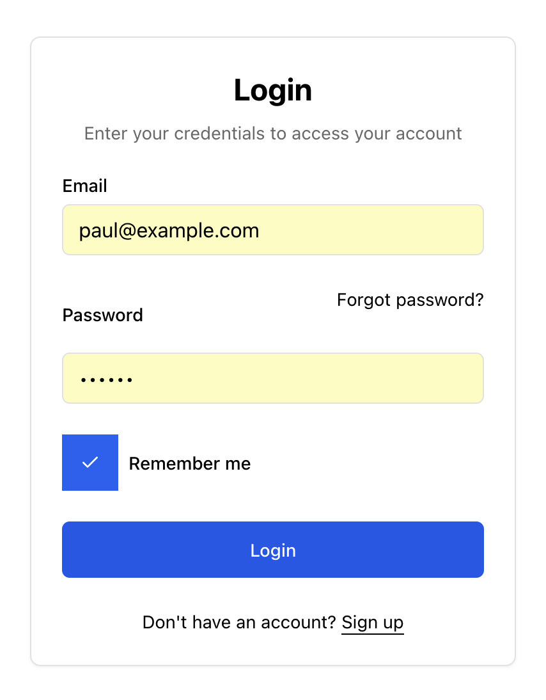
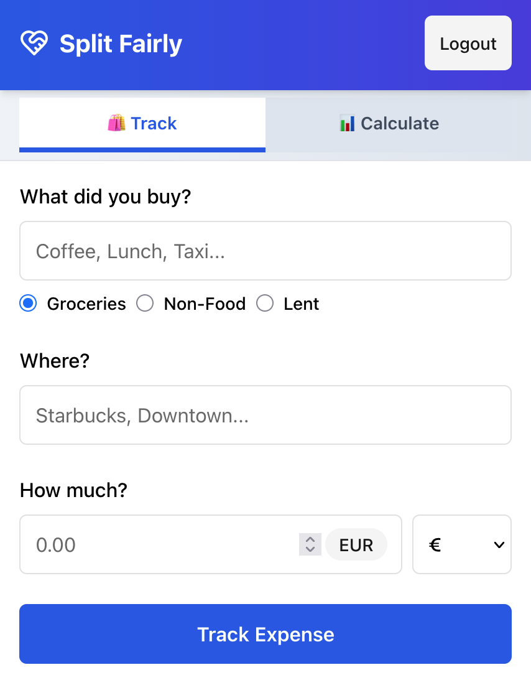
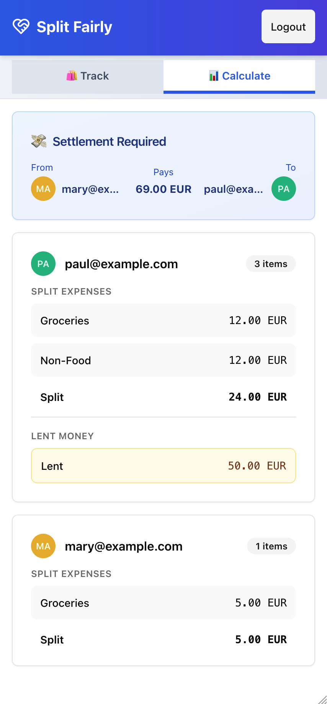

# Split Fairly

A modern web application for transparently splitting expenses and settling debts among groups. Built with **event sourcing** to maintain a complete audit trail of all financial transactions. Track shared costs, calculate who owes whom, and manage group finances effortlessly. Perfect for roommates, travel groups, and collaborative projects.

## Prerequisites

- [Make](https://www.gnu.org/software/make/)
- [Docker](https://www.docker.com/)
- [Docker Compose](https://docs.docker.com/compose/)

## Getting Started

```bash
make build    # Build image, start services, and open in browser
make init     # Initialize database and load fixtures
```

Visit `http://localhost:8000` in your browser.

## Screenshots




