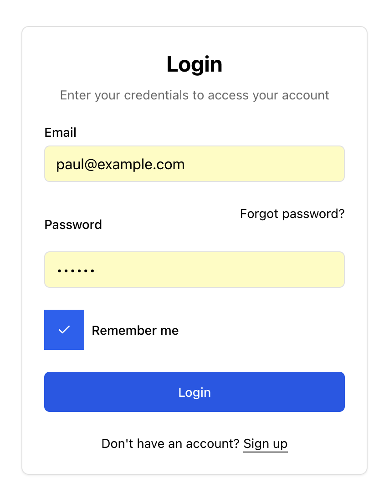
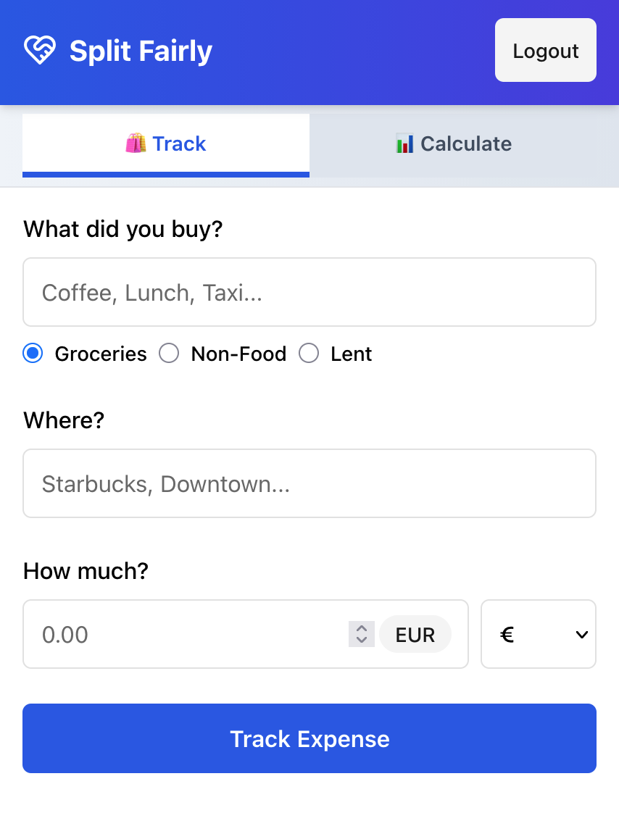
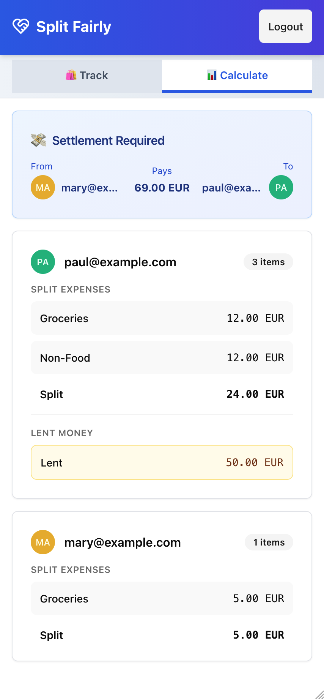

# Split Fairly


[](https://codecov.io/gh/makomweb/split-fairly)

A modern web application for transparently splitting expenses and settling debts among groups. Built with **event sourcing** to maintain a complete audit trail of all financial transactions.

Track shared costs, calculate who owes whom, and manage group finances effortlessly. Perfect for roommates, travel groups, and collaborative projects.

Follows DDD principles for separating the application into generic, core, and supporting domains - enforced by [deptrac](https://github.com/deptrac/deptrac).

## Local Development (Docker Compose)

For development without Kubernetes:

```bash
make start    # Build images, start services, and open in browser
make help     # Show all available targets
```

Visit `http://localhost:8000` in your browser.

## Getting Started

### Quick Start (Docker Compose)

```bash
make start    # Build image, start services, and open in browser
make help     # to show all targets
```

Visit `http://localhost:8000` in your browser.

---

<table>
  <tr>
    <td></td>
    <td></td>
    <td></td>
  </tr>
</table>